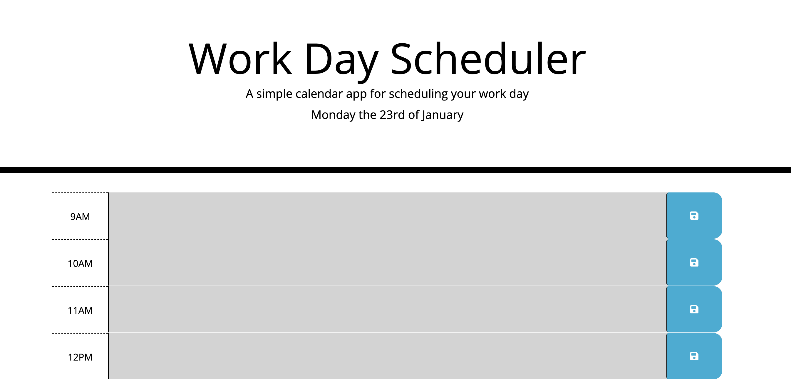

# planner-app

## Description 

I have designed a website using bootstap and its code, to showcase what i believe are my best traits and showcasing them via my website. Having kindly been provided the HTML and CSS starter code. I have been able to Javascript and the integration of moment.js to create a weekday planner application. I have incorparated my version of a website that has all the points needed for my module task. The weekly planner application keeps up to date with the present time which is reflected within slots of time. It also allows a user to enter an event when they click into a slot of time, and save the event in loal storage. 

User story:
Now integrated as a fully coding bootcamp student i have made here a a week planner to add impprtant events in a weekly planner using javascript fundamentals as an employee, as i want to add important events to a weekly planner so that time can be calculated perfectly. 

My motivation behind this was to advance my learning and showcase my skills using advanced JavaScriptn and integration of APIs.

## Screenshot

## Link
https://m0hammedzaber.github.io/planner-app/

## License 
MIT license